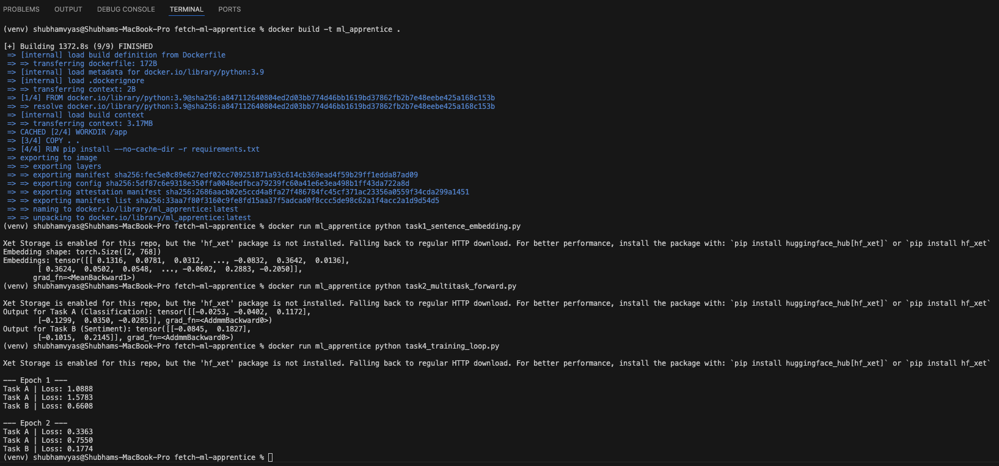

# ML Apprentice Take-Home: Sentence Transformers & Multi-Task Learning

This project implements a Sentence Transformer and expands it into a Multi-Task Learning (MTL) architecture for two NLP tasks:
- **Task A**: Sentence Classification (3 classes)
- **Task B**: Sentiment Analysis (binary)

All tasks are implemented in PyTorch using HuggingFace Transformers and can be run either locally or in Docker.

---

## Directory Structure

```
fetch-ml-apprentice/
├── models/
│   └── multitask_model.py           # Core SentenceTransformer + MTL wrapper
├── data/
│   └── dummy_data.py                # Returns synthetic sentences + labels
├── task1_sentence_embedding.py      # Task 1: Sentence embedding
├── task2_multitask_forward.py       # Task 2: Multi-task forward pass
├── task4_training_loop.py           # Task 4: Mock training loop
├── train.py                         # Combined training loop for both tasks
├── requirements.txt
├── analysis.md                      # Task 3: Architecture & training strategy
├── Dockerfile
└── README.md                        # You're reading this!
```

---

## Tasks Overview

| Task | File                         | Output |
|------|------------------------------|--------|
| 1    | `task1_sentence_embedding.py`| 768-dim sentence embeddings |
| 2    | `task2_multitask_forward.py` | Logits for both task heads |
| 3    | `analysis.md`               | Discussion of training strategies |
| 4    | `task4_training_loop.py`     | Loss decreasing across epochs |

Check the Ouput in my terminal running docker image:
 


---

## Local Setup

```bash
python3 -m venv venv
source venv/bin/activate   
pip install -r requirements.txt
```

### Run Tasks Locally:

```bash
python task1_sentence_embedding.py
python task2_multitask_forward.py
python task4_training_loop.py
python train.py  # Optional combined loop
```

---

## Docker Setup (Bonus)

### 1. Build the Image
```bash
docker build -t ml_apprentice .
```

### 2. Run Each Task

```bash
docker run ml_apprentice python task1_sentence_embedding.py
docker run ml_apprentice python task2_multitask_forward.py
docker run ml_apprentice python task4_training_loop.py
```

### 3.  Optional: Run Full Training
```bash
docker run ml_apprentice  # runs train.py by default
```

---

## Notes
- The project uses synthetic data for demonstration.
- Core model: `distilbert-base-uncased`
- All architecture logic is documented and modular.

---

## Author

Shubham Vyas   
vyasshubham.41@gmail.com

